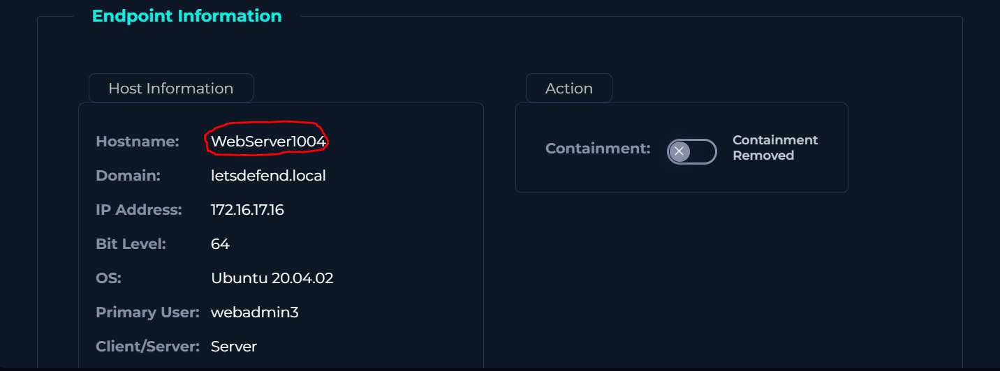
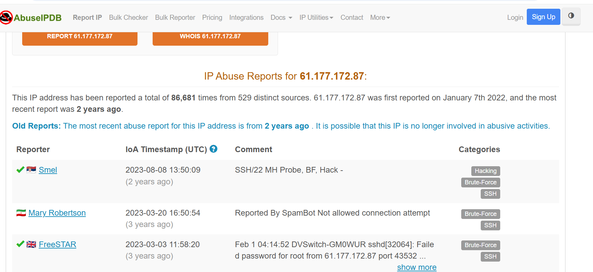
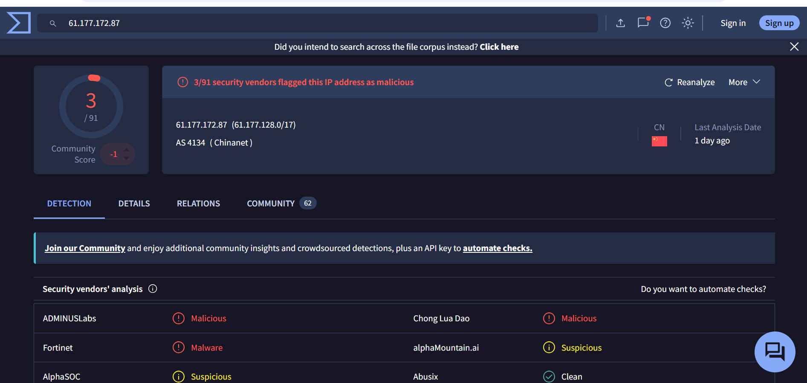
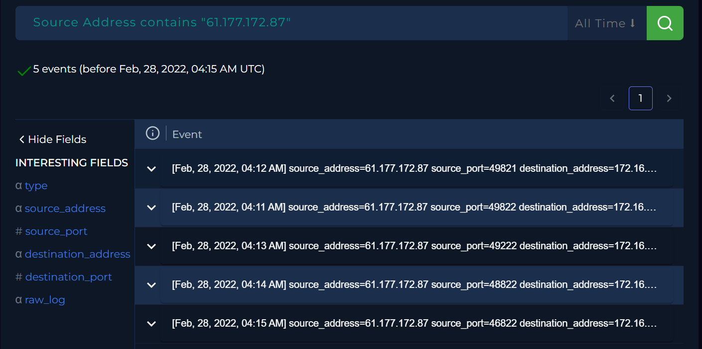
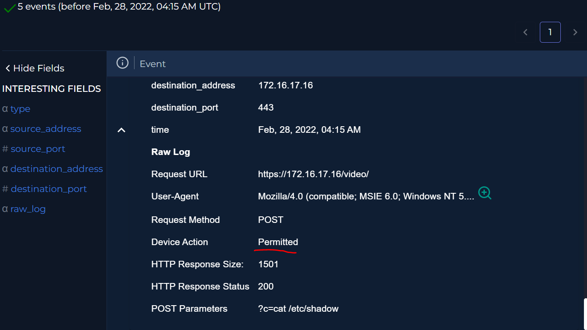
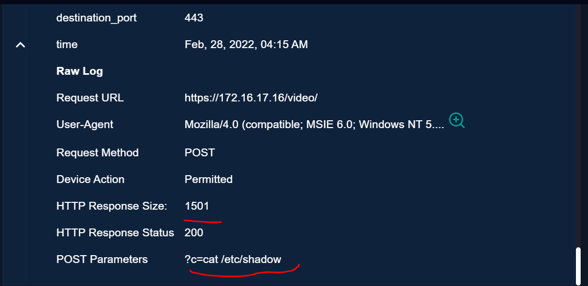
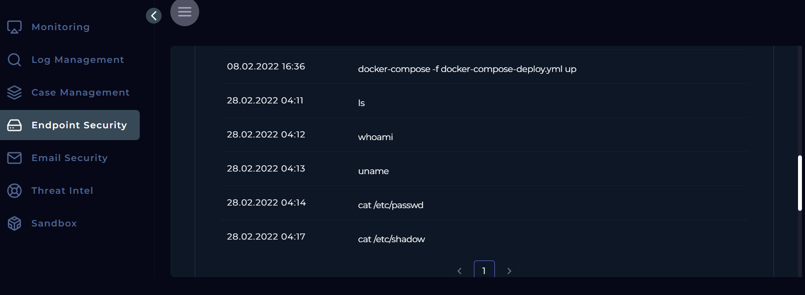
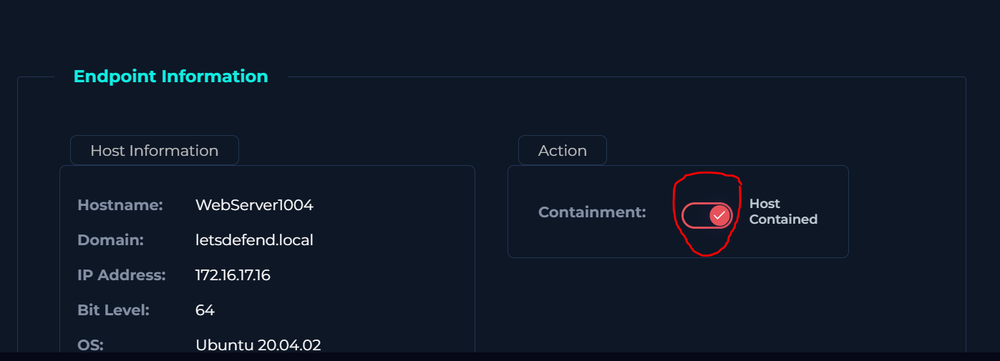

# SOC168 — Whoami Command Detected in Request Body  

> [← Back to repository index](../../README.md)

## 1. Challenge Overview  
The objective of this challenge is to investigate a security alert triggered on the SIEM dashboard by the detection rule **“Request Body Contains whoami String.”**  
  
This alert indicates that the `whoami` command was identified within the body of an HTTP request. Since this command is commonly used by attackers to verify command execution and identify the user context of a compromised system, the activity requires further analysis.  
  
The goal of this investigation is to determine whether the alert represents a **false positive** or a **true positive**. If confirmed as a true positive, the next step is to assess whether the exploitation attempt was successful, evaluate the potential impact, and define the appropriate response actions based on the severity of the incident.  
  
## 2. Alert Context  
The SIEM generated a high-severity web attack alert after detecting the string `whoami` inside the body of an HTTP POST request targeting the internal host **WebServer1004**. The request originated from the external IP address **61.177.172.87** and was sent to **172.16.17.16** via the `/video/` endpoint.  
  
The security device action was marked as **Allowed**, meaning the request was not blocked and may have reached the target application. Since `whoami` is commonly used by attackers to test command execution, this alert required further investigation to determine whether it was a false positive, an attempted exploitation, or a successful attack.  
  
## 3. Initial Triage
To begin the investigation, the core components of the alert—the source, destination, and baseline log data—must be validated.

### Host and Network Context
* **Destination IP (`172.16.17.16`):** Identifies as `WebServer1004`, a critical production asset hosting web applications within the internal network.

* **Source IP (`61.177.172.87`):** An external, public IP address originating from outside the corporate boundary, indicating inbound external traffic.

### Open-Source Intelligence (OSINT) & Reputation Check
A preliminary reputation check was conducted across external threat intelligence platforms:
* **VirusTotal & AbuseIPDB:** The source IP returned a poor reputation score, heavily flagged by the community for malicious scanning and exploitation attempts. This strongly elevates the suspicion level of the inbound traffic.

### Log Management Analysis
Navigating to the Log Management console, traffic logs were filtered exclusively for the malicious source IP (`61.177.172.87`) and the target destination (`172.16.17.16`). The query revealed a dense volume of exchange between these two entities, exclusively targeting the `/video/` endpoint. 

A granular inspection of these HTTP POST requests revealed active **input fuzzing and command injection attempts**. The threat actor was systematically passing common Unix reconnaissance commands within the request parameters, including:
* `ls`
* `whoami`
* `uname`
* `cat /etc/passwd`
* `cat /etc/shadow`

> ⚠️ **Note on "Allowed" Status:** It is crucial to note that the firewall status marked as **Allowed** or **Permitted** simply means the network security appliance permitted the traffic to cross the boundary; it does **not** signify a successful exploit. Further system-level investigation is required to determine whether the web server successfully executed these payloads.
## 4. Investigation Methodology & Response Size Analysis
Because raw HTTP response bodies are not captured or visible within our standard log view, determining whether the command injection attempts succeeded requires an alternative analytical approach. To verify if exploitation occurred, the investigation shifts focus to **Response Size Variance Analysis**.

The response payload size serves as a critical indicator of execution. If the web server is simply returning a generic error page or a standard static response, the content length (response size) will remain identical across all requests. However, if the response size varies dynamically based on the specific command passed, it strongly suggests that the web server is actively executing the injected payload and appending the command's stdout/stderr output directly into the HTTP response.

The log data revealed the following payload-to-response size correlations:

| Injected Payload | Response Size (Bytes) |
| :--- | :--- |
| `ls` | 1021 |
| `uname` | 910 |
| `whoami` | 912 |
| `cat /etc/passwd` | 1321 |
| `cat /etc/shadow` | 1501 |

### Operational Impact of the Variance
The observed variance in response sizes provides highly indicative evidence of a **True Positive (Successful Exploitation)** scenario. For example, executing `cat /etc/passwd` yields a significantly larger data block (1321 bytes) than a lightweight command like `uname` (910 bytes). This exact behavior mirrors what is expected when real system data is returned to an attacker. 

Furthermore, the response size for `cat /etc/shadow` jumped to 1501 bytes. This suggests the web application process may be running with elevated permissions (such as `root`), allowing it to successfully read restricted system files that are normally inaccessible to low-privileged service accounts.

Reviewing the Endpoint Detection and Response (EDR) logs on `WebServer1004` confirmed that the suspicious strings detected in the HTTP request bodies directly translated into system-level activity. The EDR recorded a sequence of anomalous process creations directly matching the attacker's timeline.
## 7. Incident Verdict & Technical Evidence Summary

Based on the correlation of SIEM alerts, network traffic patterns, response size variations, and host-level EDR telemetry, this incident has been officially classified as a **True Positive (Successful Exploitation)**.

### Technical Breakdown of the Incident:
* **Attack Classification:** Command Injection (Remote Code Execution - RCE).
* **Traffic Vector:** External-to-Internal (`61.177.172.87` $\rightarrow$ `172.16.17.16`).
* **Target Vulnerability:** Inadequate input sanitization on the `c` parameter exposed by the `/video/` endpoint on **WebServer1004**.
* **Impact Level:** **Critical**. The attacker successfully executed arbitrary system commands and obtained unauthorized access to sensitive system files (`/etc/passwd` and `/etc/shadow`), indicating that the vulnerable web application process was likely running with elevated root privileges.

## 8. Containment, Isolation & Escalation Actions

Given that this incident is a confirmed **True Positive with Successful Exploitation (Critical Severity)**, immediate containment and escalation protocols were initiated to limit the threat actor's lateral movement and minimize further data exposure.

### 1. Host Isolation (Immediate Containment)
* **Action:** Triggered network isolation of **WebServer1004** directly via the EDR console. 
* **Objective:** This isolates the host from both the internal corporate network and the internet, cutting off the attacker's active session and preventing lateral movement to other internal systems, while safely preserving volatile system memory for deeper forensics.

### 2. Incident Escalation
* **Action:** Escalated the case to the **Tier 2 (L2) SOC Analyst / Incident Response (IR) Team**.
* **Objective:** Handed off the verified evidence package (including the malicious source IP, vulnerable endpoint parameters, response size differentials, and EDR process creation logs) for advanced analysis, credential revocation, and deep-dive root cause analysis.

### 3. Immediate Remediation Recommendations
* Block the malicious source IP (`61.177.172.87`) at the perimeter firewall.
* Rotate all credentials stored on or accessed by `WebServer1004`, especially since `/etc/shadow` was exposed.
* Engage the development team to patch the input validation vulnerability on the `c` parameter of the `/video/` endpoint.

## 9. MITRE ATT&CK Mapping

The adversarial behavior identified during this investigation maps directly to the following tactics and techniques within the MITRE ATT&CK enterprise matrix:

| Tactic | Technique ID | Technique Name | Applied Context / Observed Behavior |
| :--- | :--- | :--- | :--- |
| **Execution** | `T1203` | Exploitation for Client Execution | Vulnerable web application parameter (`c`) exploited to run arbitrary commands on the host. |
| **Discovery** | `T1033` | System Owner/User Discovery | Execution of the `whoami` command to identify user privileges and context. |
| **Discovery** | `T1082` | System Information Discovery | Execution of the `uname` command to discover OS kernel details and architecture. |
| **Discovery** | `T1083` | File and Directory Discovery | Execution of `ls` to map out the targeted application's directory structure. |
| **Credential Access** | `T1003.008` | OS Credential Dumping: `/etc/passwd` and `/etc/shadow` | Unauthorized attempts to read local system configuration and password hash files via the `cat` utility. |