# SOC342 – ToolShell: SharePoint Authentication Bypass & RCE

**CVE-2025-53770 | CVE-2025-53771**

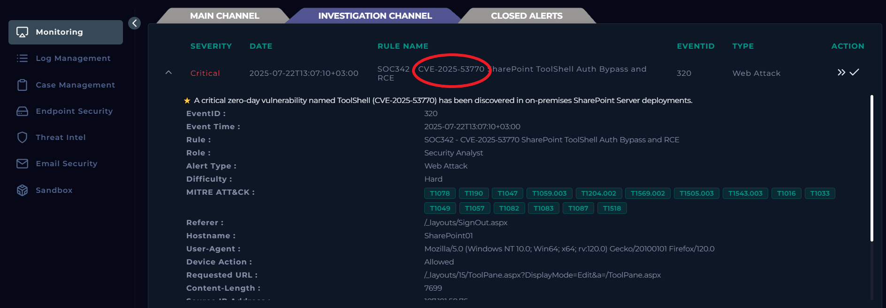

---

##  Alert Overview

In today's investigation, we are analyzing a **critical alert involving an on-premises Microsoft SharePoint Server**.

The alert was triggered by a suspicious HTTP `POST` request targeting the following SharePoint endpoint:

```http

/_layouts/15/ToolPane.aspx?DisplayMode=Edit&a=/ToolPane.aspx

```

This request strongly associated with exploitation activity related to the **ToolShell SharePoint vulnerability chain**, particularly:

| CVE                | Type                             | Purpose in the Attack Chain                                                    |

| ------------------ | -------------------------------- | ------------------------------------------------------------------------------ |

| **CVE-2025-53771** | Authentication / Security Bypass | Allows an unauthenticated attacker to reach protected SharePoint functionality |

| **CVE-2025-53770** | Remote Code Execution            | Exploits unsafe deserialization to execute code on the SharePoint server       |


Before investigating the alert itself, let's first understand some important concepts so that the analysis is easier to follow.

---

# Background

## What is SharePoint?

**Microsoft SharePoint** briefly it is a web based collaboration platform developed by Microsoft for teams/organisation o store documents, organize information, create sites, and collaborate. unlike onedrive whre the privacy is the main feature the SharePoint is primarily designed around shared/team content.

For SharePoint Server (on-premise), Microsoft requires the IIS Web Server role and .NET Framework.

The ToolShell vulnerabilities specifically affect **on-premises SharePoint Server**. Microsoft states that **SharePoint Online in Microsoft 365 is not affected** by this vulnerability chain.

---

#  What is ToolShell?

**ToolShell** is the name commonly used for an exploit chain targeting vulnerable Microsoft SharePoint servers.

At a high level, the attack can be understood as two main stages:

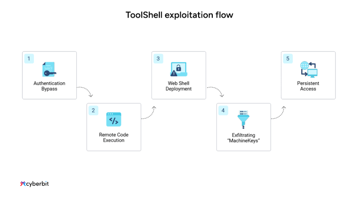

CVE-2025-53770 is an **unsafe deserialization vulnerability** that allows an unauthorized attacker to execute code remotely. CVE-2025-53771 addresses the bypass side of the ToolShell chain and is related to the previously disclosed CVE-2025-49706 vulnerability.

---

#  Stage 1 – Authentication Bypass

The first objective of the attacker is simple:

> **Reach functionality that should normally require authentication without providing valid credentials.**

One of the endpoints involved in ToolShell exploitation is:

```http

/_layouts/15/ToolPane.aspx

```

## What is `ToolPane.aspx`?

`ToolPane.aspx` is associated with SharePoint's **Web Part configuration functionality**.

A Web Part is essentially a component displayed inside a SharePoint page.

The Tool Pane provides configuration functionality for these Web Parts.

It is therefore better to think of it as:

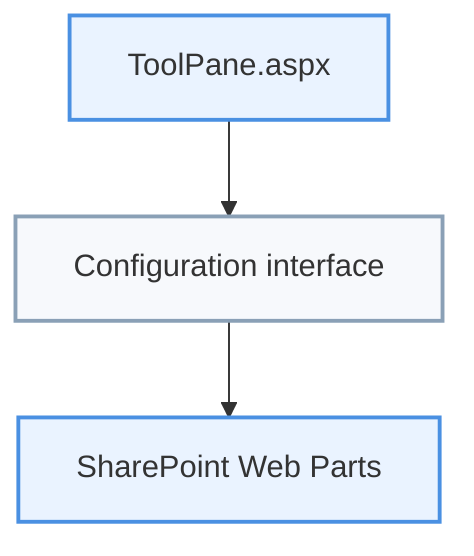

rather than as the complete SharePoint administrator panel.

---

# Understanding the HTTP `Referer` Header

Before understanding the bypass, we need to understand one HTTP header:

```http

Referer:

```

The `Referer` header can tell a web server **which page the client came from before making the current request**.

For example, imagine that we are visiting:

```text

https://target.com/users

```

and click a link that sends us to:

```text

https://target.com/dashboard

```

The browser may send:

```http

GET /dashboard HTTP/1.1

Host: target.com

Referer: https://target.com/users

```

From the server's perspective:

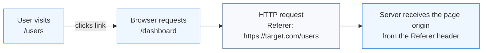

And the request effectively says:

```text

"I'm requesting /dashboard,

and I came from /users."

```

### Why is this important?

The `Referer` header is **client-controlled information**.

An attacker does not necessarily need to visit the page specified in the header. A manually crafted HTTP request can provide a different `Referer` value.

If an application makes a security decision based incorrectly on this value, an attacker may be able to abuse that trust.

---

## ToolShell Authentication Bypass

When the server receives an HTTP request with a Referer header pointing to

**/_layouts/SignOut.aspx**, SharePoint's auth pipeline treats the request as

part of an already-established internal navigation flow (sign-out is a page

a logged-in user's browser would normally be redirected *from*), rather than

independently re-validating the session or requiring form digest / CSRF

validation for that request.

This is a textbook case of **trusting client-supplied metadata (a header)

as a proxy for server-side session state** — the Referer value is fully

attacker-controlled and never cryptographically tied to an actual session.

A simplified representation:

```http

POST /_layouts/15/ToolPane.aspx?DisplayMode=Edit&a=/ToolPane.aspx HTTP/1.1

Host: sharepoint-server

Referer: /_layouts/SignOut.aspx

```

The important part for SOC detection is the combination of:

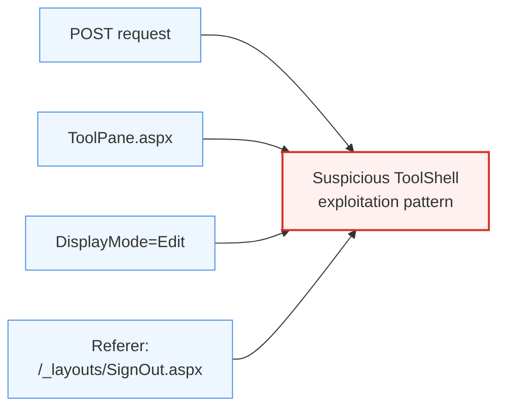

With this combination, the attacker's request reaches ToolPane.aspx's

Web Part configuration/deserialization logic without passing normal

auth/digest checks — the entry point that CVE-2025-53770 then exploits

for RCE.

## Stage 2 – Remote Code Execution via Unsafe Deserialization

After bypassing the authentication controls, the attacker can abuse the second vulnerability in the ToolShell chain to achieve **Remote Code Execution (RCE)**.

This stage is associated with:

```text

CVE-2025-53770

```

The vulnerability exists because SharePoint can **deserialize attacker-controlled data without sufficiently validating the types contained inside it**.

Before looking at the exploit itself, let's first understand **serialization and deserialization**.

---

### What are Serialization and Deserialization?

**Serialization** is the process of converting an object or complex data structure into a format that can easily be Stored /Transmitted over a network

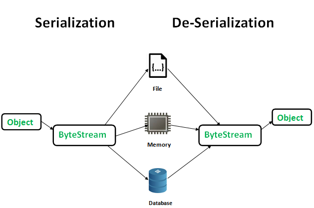

Deserialization itself is completely normal and is used by many applications.

The security problem appears when an application **deserializes data controlled by an attacker without properly validating what objects or types are allowed to be created**.


## How ToolShell Abuses Deserialization

The attacker sends a specially crafted `POST` request to the vulnerable SharePoint `ToolPane.aspx` endpoint.

The same request can contain:

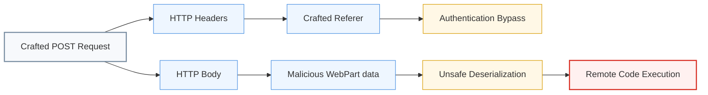

The request body contains two important parameters:

```text

MSOtlPn_Uri

MSOtlPn_DWP

```

`MSOtlPn_DWP` contains **WebPart markup** controlled by the attacker.

The malicious markup causes SharePoint to instantiate an `ExcelDataSet` control and places attacker-controlled serialized data inside its:

```text

CompressedDataTable

```

property.

The attack flow can be simplified as:

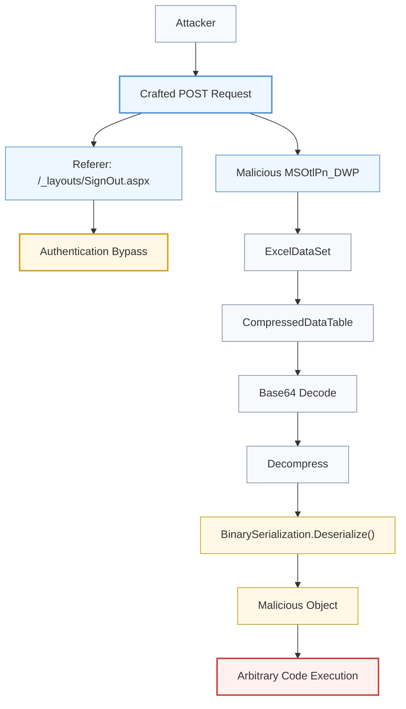

Internally, SharePoint takes the content supplied through `CompressedDataTable`, **Base64-decodes it, decompresses it, and passes the resulting data to `BinarySerialization.Deserialize()`**.

Normally, SharePoint uses an `XmlValidator` to restrict which object types are allowed during deserialization.

However, the vulnerable implementation could be bypassed. Attackers were able to place a dangerous `.NET` `ExpandedWrapper` object inside another collection, allowing the malicious type to pass the validation process and eventually trigger arbitrary method execution.

Therefore, the vulnerability is essentially:

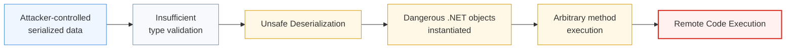

With that code-execution primitive, the attacker can write arbitrary files — most

commonly a **web shell** — to a publicly accessible directory on the server

(e.g., the LAYOUTS directory), such as the observed `spinstall0.aspx`. Because that

directory is served by IIS, the dropped file becomes directly reachable via a

**separate, follow-up HTTP request**, letting the attacker use it for further actions

like extracting the ASP.NET machine keys (ValidationKey/DecryptionKey) or executing

further commands/RCE — without needing to repeat the original deserialization exploit

each time.

# Initial Alert Analysis

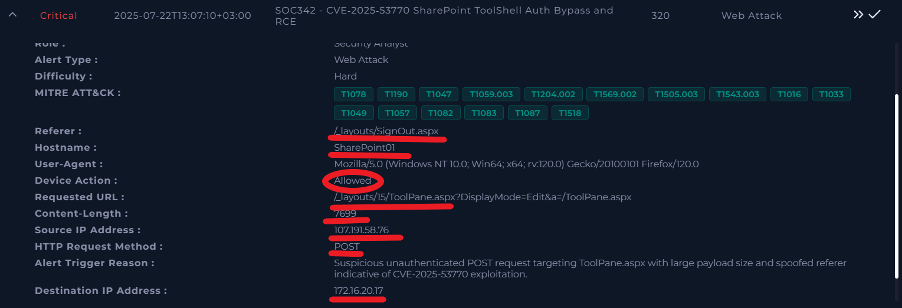

The investigation begins with the information provided in the alert:

* **Attacker IP:** `107.191.58.76`

* **Target IP:** `172.16.20.17`

* **Hostname:** `SharePoint01`

* **Action:** `Allowed`

* **Target URL:** `/_layouts/15/ToolPane.aspx?DisplayMode=Edit&a=/ToolPane.aspx`

The `Allowed` action indicates that the security control did not block the HTTP request and that the request was permitted toward the SharePoint server. However, this alone does not confirm that exploitation was successful.

Several elements immediately make this alert highly suspicious.

The request targets the SharePoint `ToolPane.aspx` with endpoint This URL pattern is associated with exploitation activity targeting **CVE-2025-53770 (ToolShell)**.

Additionally, the request contains a crafted `Referer` header pointing to:

`/_layouts/SignOut.aspx`

The combination of the `ToolPane.aspx` endpoint, `DisplayMode=Edit`, and the `SignOut.aspx` referer matches known indicators associated with exploitation attempts against vulnerable Microsoft SharePoint servers.

At this stage, the alert should therefore be considered **critical and highly suspicious**. The next step is to investigate the activity occurring on `SharePoint01` immediately after this HTTP request to determine whether the exploitation attempt resulted in code execution or further compromise.

First, let's check the reputation of the attacker's IP address:

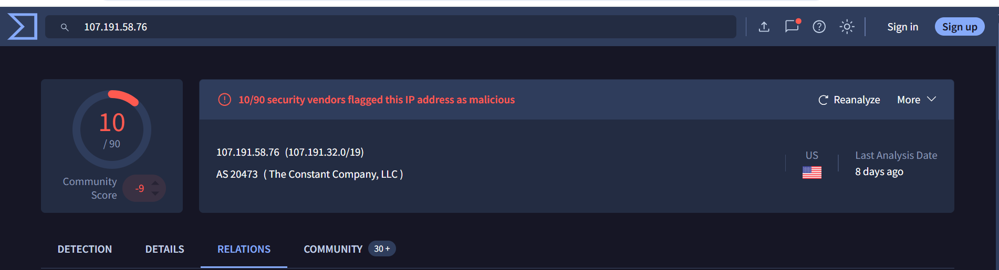

The IP appears suspicious, as **10 security vendors have flagged it as malicious or suspicious**. This is a strong indicator that more investigation is required.

Next, we moved to the log management platform to investigate the communication between the attacker and the SharePoint server.

To avoid missing any relevant activity, we searched for multiple traffic directions:

* Attacker IP as the **source IP** and the SharePoint server as the **destination IP**.

* SharePoint server as the **source IP** and the attacker IP as the **destination IP**.

* Additional activity involving the SharePoint server that could indicate follow-up connections or outbound communication.

This helps us examine the full sequence of events, from the initial request to any possible response or subsequent network activity. It is especially important because an attacker may send a malicious request to the server and then trigger additional connections to another infrastructure.

During the investigation, we found **only one log entry related to the initial request from the attacker**.

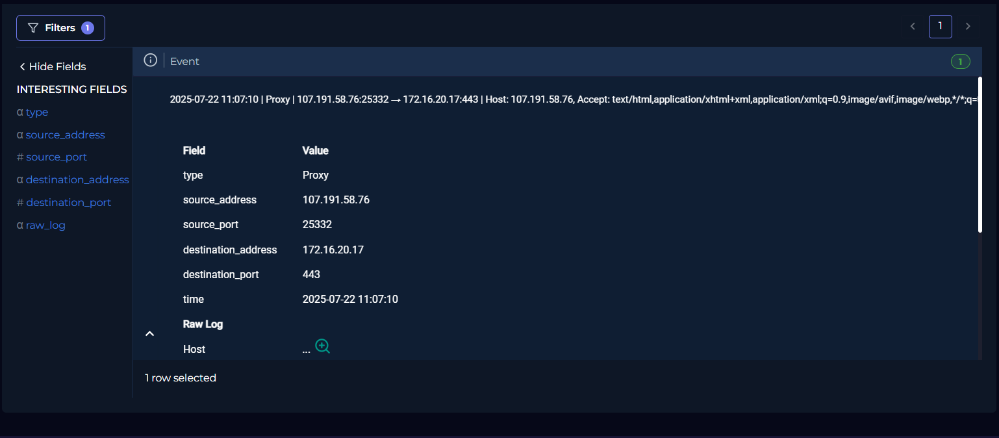

The request targeted the **ToolPane endpoint**, contained a **Referer header**, and used the **HTTP POST method**.

Although the actual POST request body is not available in the logs, the recorded **Content-Length is 7699 bytes**, which indicates that a relatively large amount of data was included in the request body.


## Endpoint Analysis

Moving to the endpoint security solution and searching for the hostname **`SharePoint01`**, we can observe several useful artifacts, including **process execution, command-line activity, and network connections**.

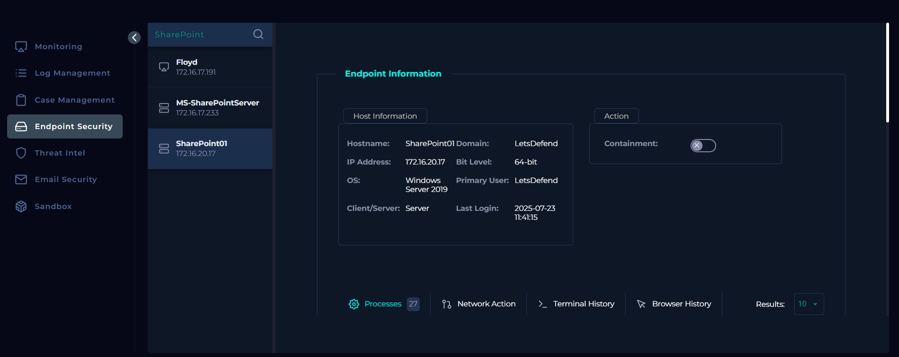

To correlate the endpoint activity with the suspicious request identified earlier, we should keep the request timestamp in mind:

**2025-07-22 13:07:10 UTC+03**

Next, we examined the process activity around this time.

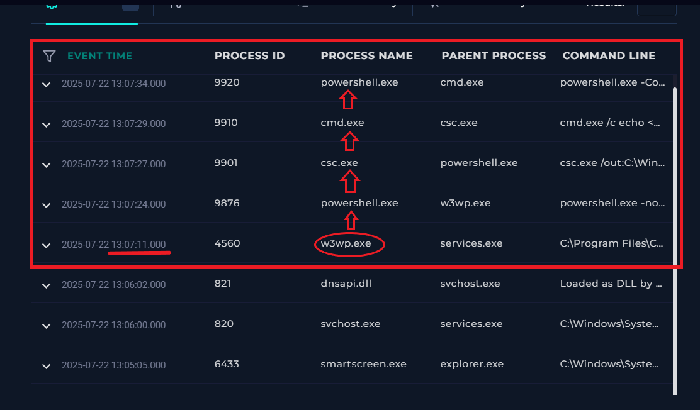

From the process tree, we can observe a suspicious chain of child processes starting with **`w3wp.exe`**, the IIS worker process responsible for handling requests to the SharePoint web application.

The observed process chain is approximately:

`w3wp.exe` → `powershell.exe` → `csc.exe` → `cmd.exe` → `powershell.exe`

This is highly suspicious. Under normal circumstances, an IIS worker process should not typically spawn PowerShell, which then launches the C# compiler (`csc.exe`) and additional command shells. This strongly suggests that code execution occurred through the SharePoint application.

We then investigated the command line of the first PowerShell process spawned by `w3wp.exe`.

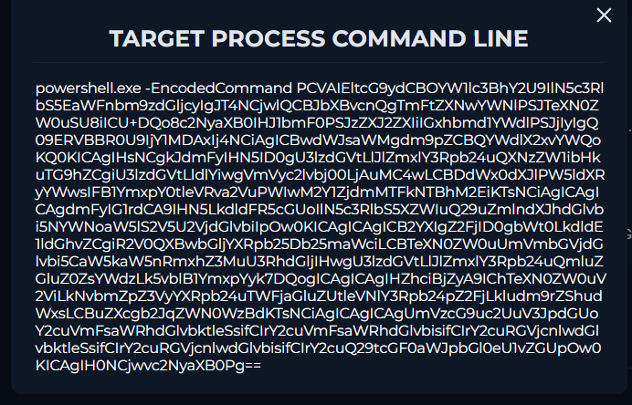

The PowerShell command contains a **Base64-encoded payload**, so we decoded it using CyberChef.

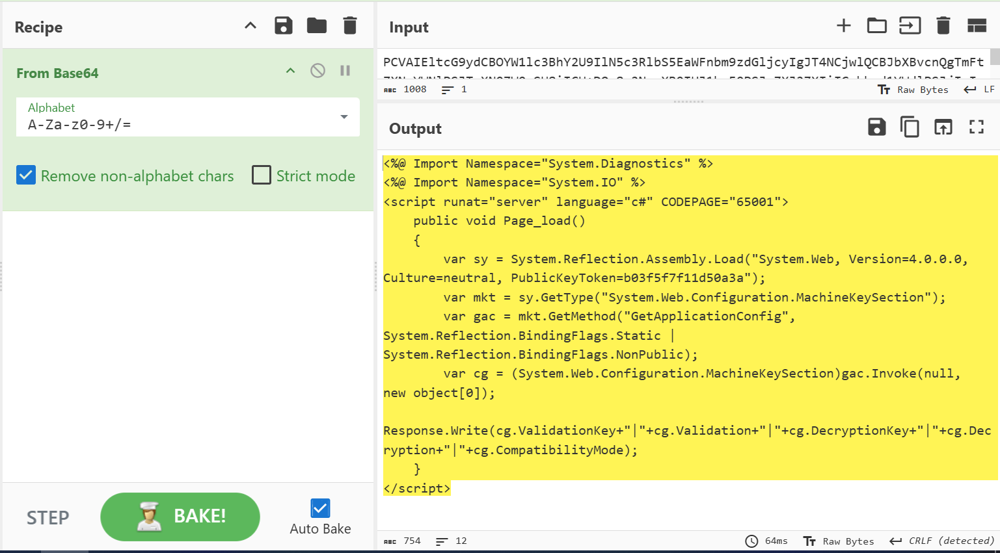

The decoded content is an **ASP.NET/C# payload** designed to retrieve the application's MachineKey configuration, including values such as the **validation key and decryption key**.

However, there is an important inconsistency in the telemetry. The decoded content is C#/ASP.NET code and cannot be executed directly as normal PowerShell syntax. This suggests that the endpoint logs may not contain the complete execution context, or that an intermediate step responsible for compiling or writing the C# payload is missing from the available telemetry.

The presence of `csc.exe` in the process chain supports this possibility, since `csc.exe` is the Microsoft C# compiler and could have been used as part of the execution flow.

Despite the incomplete visibility into every intermediate step, the process tree provides strong evidence that the attacker successfully triggered **remote code execution on the SharePoint server**, because the IIS worker process (`w3wp.exe`) spawned attacker-controlled command-line processes shortly after the malicious HTTP request.

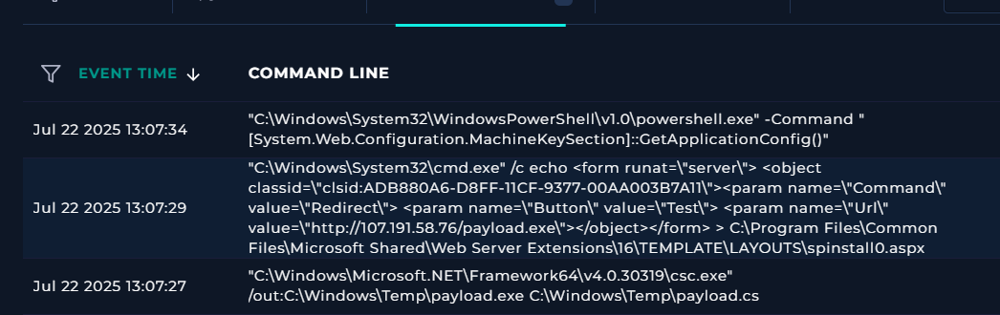

After gaining code execution via the ToolPane deserialization exploit, the attacker's

actions on this host proceed in three steps:

1. **Payload compilation** — The attacker compiles `payload.cs` into `payload.exe`

   using the legitimate, built-in .NET compiler (`csc.exe`), with the output written

   to `C:\Windows\Temp`. Notably, the available telemetry contains no log showing how

   `payload.cs` itself was written to disk — its origin (e.g., which prior command

   dropped it) is not visible in this dataset.

2. **Webshell/dropper deployment** — The attacker writes an `.aspx` file

   (`spinstall0.aspx`) into the public LAYOUTS directory, which is directly reachable

   by any HTTP request. Its content redirects to the attacker's server to fetch

   `payload.exe`, effectively turning this file into a remotely-triggerable dropper

   for the compiled payload.

3. **Key theft** — The attacker uses a built-in .NET API

   (`MachineKeySection.GetApplicationConfig()`) via PowerShell to extract the

   server's ValidationKey and DecryptionKey. Stealing these keys lets the attacker

   forge valid, signed ViewState payloads even after the SharePoint vulnerability

   itself is patched — giving them **persistent access independent of the original

   exploit.**

## Mitigation

1. **Contain the host immediately** — isolate the affected SharePoint server from

   the network to stop further attacker activity (C2 communication, lateral

   movement, additional payload delivery).

2. **Escalate to N2** — this is a **critical alert** given confirmed RCE and

   evidence of key theft; do not hold at N1.

3. **Rotate ASP.NET machine keys** (`ValidationKey` / `DecryptionKey`) on all

   SharePoint servers — containment alone does not invalidate keys the attacker

   already stole, so forged ViewState payloads would remain valid until rotation.

4. **Patch** the SharePoint server to the version that fixes CVE-2025-53770 /

   CVE-2025-53771 (the July 20 update, not just the incomplete July 8 patch).

5. **Hunt for persistence** — search the LAYOUTS directory and other web-accessible

   paths for additional dropped web shells (e.g. `spinstall0.aspx` or similarly

   named files) beyond the one already identified.

## MITRE ATT&CK Mapping

| Stage | Tactic | Technique | ID |

|---|---|---|---|

| Referer-spoofed request to ToolPane.aspx | Initial Access | Exploit Public-Facing Application | T1190 |

| Malicious DWP markup → deserialization → code execution | Execution | Exploitation for Client Execution / Command and Scripting Interpreter | T1203 / T1059 |

| `csc.exe` compiling `payload.cs` → `payload.exe` | Defense Evasion | Compile After Delivery | T1027.004 |

| Use of built-in `csc.exe` / `cmd.exe` / PowerShell instead of custom tools | Defense Evasion | Living off the Land (LOLBins) — reflected via System Binary Proxy Execution | T1218 |

| `spinstall0.aspx` dropped into public LAYOUTS directory | Persistence | Server Software Component: Web Shell | T1505.003 |

| `spinstall0.aspx` fetching `payload.exe` from attacker server | Command and Control | Ingress Tool Transfer | T1105 |

| PowerShell call to `MachineKeySection.GetApplicationConfig()` | Credential Access | Unsecured Credentials | T1552 |

| Stolen ValidationKey/DecryptionKey used to forge future ViewState payloads | Persistence | Valid Accounts / Forge Web Credentials (closest fit — no exact ATT&CK sub-technique for ASP.NET machine-key forgery specifically) | T1606 |

| Outbound connection to `107.191.58.76` | Command and Control | Application Layer Protocol / Web Protocols | T1071.001 |


## Artifcats :

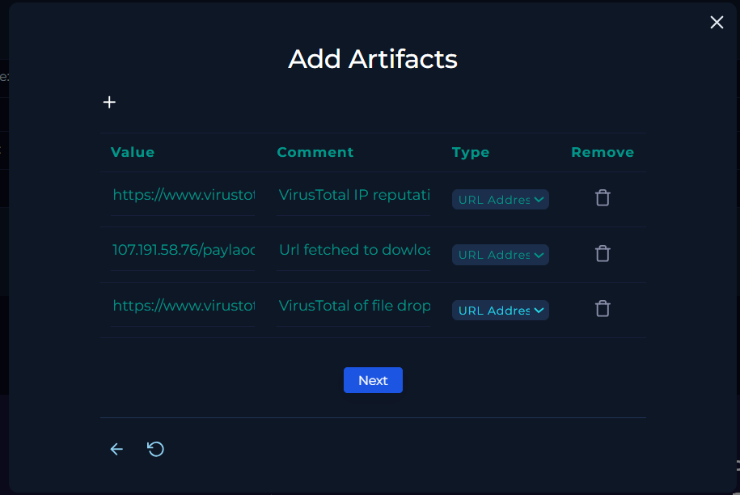

## DONE

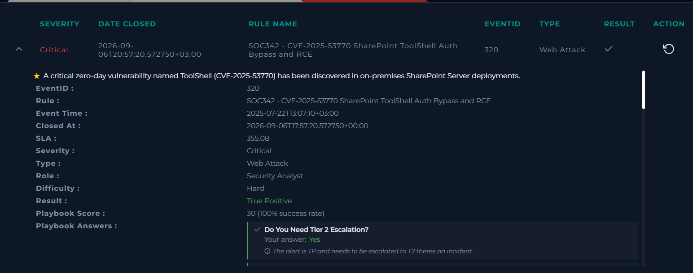